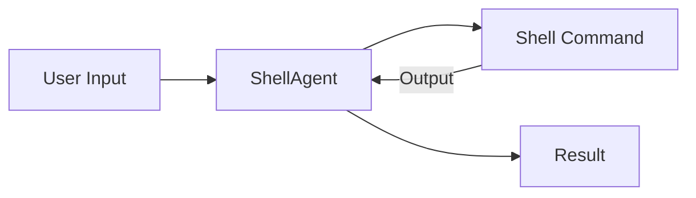

# How Cogni works
*Condensed version*

## Foreword

I'll be feeding the repo for the coming week. As of right now, it's a mess. So I decided to write this markdown that explains briefly all the ideas Cogni is based on.

## Philosophy

A trend in computer science is to be able to implement anything with higher and higher abstractions.

We went from binary code on punch cards, to assembly, to C (not the first language historically, but that's beside the point), to eventually Python, and even further: Frameworks.

What happens is that, as time goes on and technology progress, implementing a given software behavior is done by manipulating higher and higher abstraction, therefore write less and less code.

Cogni aims at providing the highest possible abstractions to implement agents.

Said otherwise, any framework should aim at allowing for implementing absolutely anything by writing only the parts that change.

## Starting point: What IS an agent anyway ?

*Thinking about implementing a framework should start by specifying the behaviors of the highest level abstractions at use time. And ONLY then, think about implementation details*


I'll illustrate with `ShellAgent`.
**Specs**: `ShellAgent` interacts (with arbitrarily many rehops) with a shell instance. Can do anything you can do with a shell, and returns anything, with the Python type specified in the prompt.

### `ShellAgent`: At use time/From the outside

```python
from cogni import Agent

prompt = """I want you to go to my desktop dir, which contains the directory `Images`.

I want you to create a dir `Images/Thumbnails/`, create thumbnails (128x128) for all png in `Images` and then return a list containing the absolute path for all the thumbnails
"""

print(Agent['ShellAgent'](prompt))
#> [
#   '/home/v/Desktop/Images/Thumbnails/cute-cats.png',
#   '/home/v/Desktop/Images/Thumbnails/avatar.png',
#   '/home/v/Desktop/Images/Thumbnails/stuff.png',
#  ]

```

### `ShellAgent` implementation details overview



The diagram shows the basic flow:
1. User input is sent to ShellAgent
2. Agent processes input and executes shell command
3. Shell output is returned to agent
4. Agent formats and returns final result


