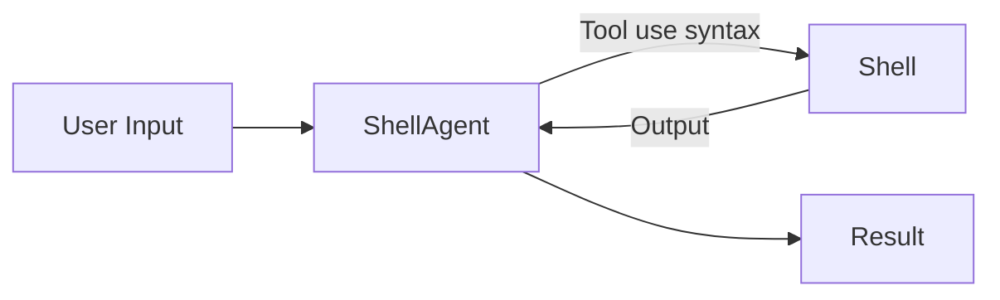
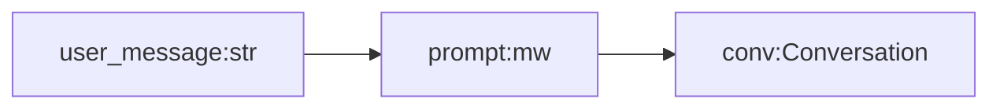
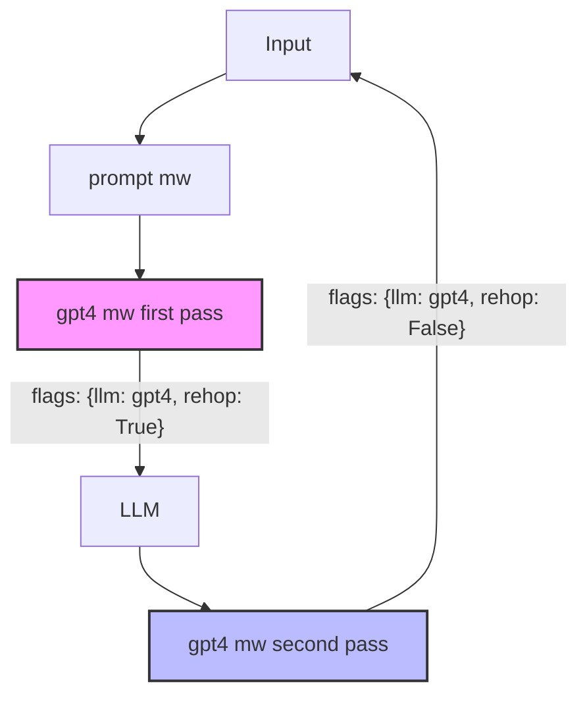

# How Cogni works
*Condensed version*

## Foreword

I'll be feeding the repo for the coming week. As of right now, it's a mess. So I decided to write this markdown that explains briefly all the ideas Cogni is based on.

## Philosophy

A trend in computer science is to be able to implement anything with higher and higher abstractions.

We went from binary code on punch cards, to assembly, to C (not the first language historically, but that's beside the point), to eventually Python, and even further: Frameworks.

What happens is that, as time goes on and technology progress, implementing a given software behavior is done by manipulating higher and higher abstraction, therefore write less and less code.

Cogni aims at providing the highest possible abstractions to implement agents.

Said otherwise, any framework should aim at allowing for implementing absolutely anything by writing only the parts that change.

## Starting point: What IS an agent anyway ?

*Thinking about implementing a framework should start by specifying the behaviors of the highest level abstractions at use time. And ONLY then, think about implementation details*


I'll illustrate with `ShellAgent`.
**Specs**: `ShellAgent` interacts (with arbitrarily many rehops) with a shell instance. Can do anything you can do with a shell, and returns anything, with the Python type specified in the prompt.

### `ShellAgent`: At use time/From the outside

```python
from cogni import Agent

prompt = """I want you to go to my desktop dir, which contains the directory `Images`.

I want you to create a dir `Images/Thumbnails/`, create thumbnails (128x128) for all png in `Images` and then return a list containing the absolute path for all the thumbnails
"""

print(Agent['ShellAgent'](prompt))
#> [
#   '/home/v/Desktop/Images/Thumbnails/cute-cats.png',
#   '/home/v/Desktop/Images/Thumbnails/avatar.png',
#   '/home/v/Desktop/Images/Thumbnails/stuff.png',
#  ]

```

### `ShellAgent` implementation details overview



In words:
We want the LLM to run commands using tools
Every time a command is made, the agent is prompted back with the output of the command.
When agent has no more command to run, it returns the output (we'll see later about the "Of any type" part)


### `ShellAgent` implementation: init agent

- **Step 1**: create agents boilerplate using `cogni`
  ```bash
  ~ cd ourProject
  ~ cogni create_agent ShellAgent
  ```

It will create the following file structure:

```
agents/
└── ShellAgent/
    ├── agents/
    │   └── ShellAgent.py 
    ├── middlewares/
    │   └── shellagent_loop.py
    ├── prompts/
    │   └── ShellAgent.conv   
    └── tools/
        └── shellagent_tools.py 
```

### `ShellAgent` implementation: prompting our agent

Let's go to `agents/ShellAgent/prompts/ShellAgent.conv`
and give it that content
```yaml

system: You are ShellAgent, a shell AGI that performs cli operations.

## **Thinking**
You'll think step by step using <Thinking></Thinking>

## **Using Tool**
To use a tool, simply include the tool use syntax in your output. You'll be prompted back with the output.
/!\ ONLY ONE TOOL use per message
/!\ One command at a time

## **Tools**
<tool name="shell">ls -la</shell>

## **Reply**
Use <Reply></Reply> for your final reply

__-__

user: Can you tell me how much space I have left on / ?

__-__

assistant:<Thinking>
- I should use `df` for that
- I'll use "-h" to have it readable
- I'll execute the command, I'll be prompted back with the result
- At which point I should answer politely and give the information user asked for
</Thinking>

<tool name="shell">df -h /</tool>

__-__

system:## Output from tool `shell`

'''
Filesystem      Size  Used Avail Use% Mounted on
/dev/sdc       1007G  586G  371G  62% /
'''

__-__

assistant:<Thinking>
- OK, so, `371G` should be the information user wanted
- I have no more command to run
- I'll reply to user :)
</Thinking>

<Reply>
The available space on `/` is `371G`.
</Reply>
```


#### **Agent Declaration**

opening `agents/ShellAgent/agents/ShellAgent.py` you'll find:
```python
# agents/ShellAgent/agents/ShellAgent.py
from cogni import Agent

Agent('ShellAgent', 'prompt|gpt4|shellagent_loop')
```

Let's break it down:
- The first arg is the agent name
    it will allow you to use `Agent['ShellAgent']('input')`

- The second arg is the middleware chain.

### How `MiddleWare` works

Whatever you input to `Agent[agent_name](...)` will be passed to the first middleware.

The output of a middleware will be passed to the next middleware and so on. 

**Except for one special case**:
If a middleware returns an instance of `cogni.Conversation` with the flag `rehop`, it will trigger a LLM inference, and the resulting conversation will be fed to the same middleware.

Let's take a step back and illustrate it by adding one middleware at a time

### Taking a step back: `SimpleAgent`

- **1** Let's create an new agent
```bash
~ cogni create_agent SimpleAgent
```

```
agents/
└── SimpleAgent/
    ├── agents/
    │   └── SimpleAgent.py 
    ├── middlewares/
    │   └── simpleagent_loop.py
    ├── prompts/
    │   └── SimpleAgent.conv   
    └── tools/
        └── simpleagent_tools.py 
```

- **2** Prompting
in `agents/SimpleAgent/prompts/SimpleAgent.conv`

```yaml
system: You are SimpleAgent.
You're a demonstration agent for a tutorial.

You can use:
<tool name="get_time"></tool>
```

- **3** Agent declaration, one step at a time

**We'll add one middleware at a time so you get a feel of what happens

 `agents/ShellAgent/agents/ShellAgent.py`
 ```python
 from cogni import Agent

# Let's change:
# Agent('SimpleAgent', 'prompt|gpt4|simpleagent_loop')
# Into:
Agent('SimpleAgent', 'prompt')
```

____________
The `prompt` middleware is builtin.

I takes string as input, and return the conversation from the prompt file.



At this stage:
```python
# main.py
from cogni import Agent

print(Agent['SimpleAgent']('What time is it ?'))
```

Won't involve any LLM and will return an instance of `cogni.Conversation`

____________
Let's add the `gpt4` middleware:

```python
Agent('SimpleAgent', 'prompt|gpt4')
```

The `gpt4` middleware:
1. Sets the conversation flags:
   - `llm: "gpt4"` - specifies which model to use
   - `rehop: True` - but only if hops == 0 (first pass)
2. Returns the conversation

When `rehop` is True, the conversation goes through LLM inference
Then comes back to `gpt4` middleware, which:
1. Sets `rehop: False` (since hops > 0)
2. Returns the conversation with the LLM's response




```
            ╭───────────────────────╮
            │ 🏳️␣flags:             │
            │     llm:   None       │
            │     rehop: False      │
            │     hops:  0          │
            ╰───────────────────────╯
    
╭━━━━━━━━━━━━━━━━━━━━━━━━━━━━━━━━━━━━━━━━━━━━━━━━╮
│ 🤖‍␣system: You are SimpleAgent.                │
│ You're a demonstration agent for a tutorial.   │
│                                                │
│ You can use:                                   │
│ <tool name="get_time"></tool>                  │
╰━━━━━━━━━━━━━━━━━━━━━━━━━━━━━━━━━━━━━━━━━━━━━━━━╯
╭━━━━━━━━━━━━━━━━━━━━━━━━━━━━━━━━━━━━━━━━━━━━━━━━╮
│ 🧑␣user: What time is it ?                     │ 
╰━━━━━━━━━━━━━━━━━━━━━━━━━━━━━━━━━━━━━━━━━━━━━━━━╯
```


